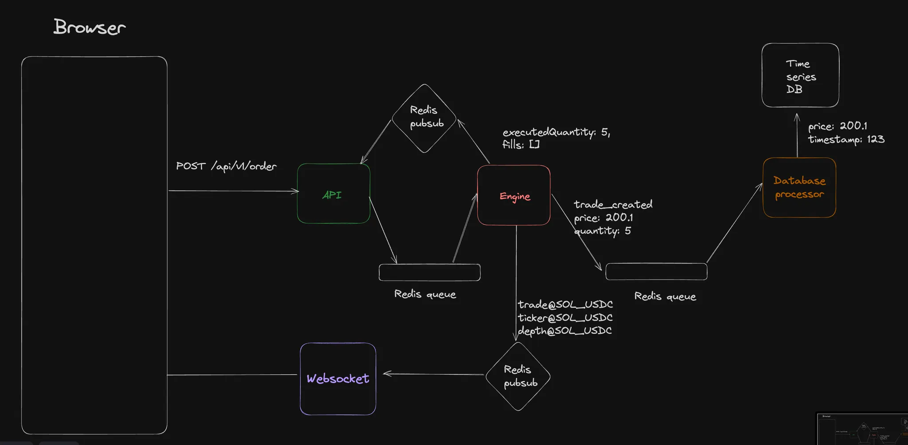

# Momentum

Momentum is a low-latency, centralized crypto exchange, building in RUST programming language.

## Backend Architecture

For now, We have the following services - 

1. **API** - An API Server the user sends HTTP requests to
2. **Engine** - Runs various market orderbooks, stores user balances in memory
3. **Websocket** - Websocket server that user subscribes to real time events from
4. **DB Processor** - Processes messages from the `Engine` and persists them in the DB
5. **Frontend** - NextJS app.
6. **Redis** - Queue and redis pub-sub
7. **TimescaleDB** - Creates buckets of klines based on price feed

## Contributing
All Contributions are welcome ❤️